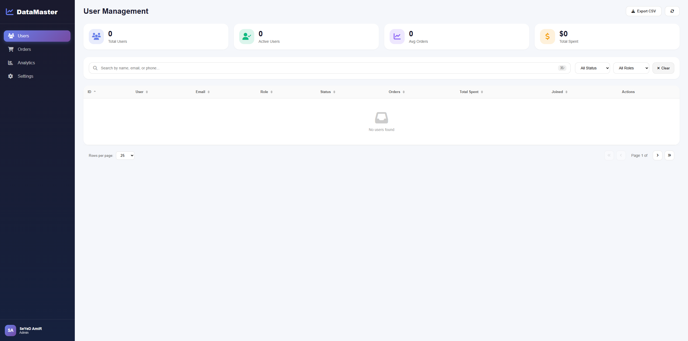
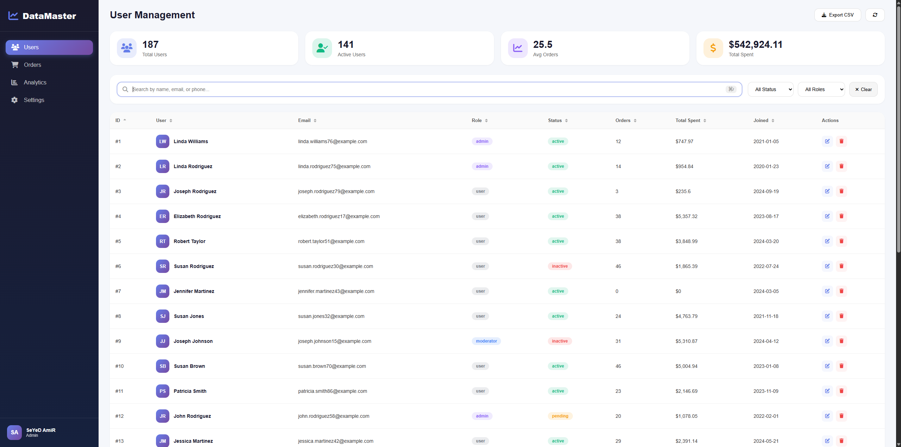

# DataMaster Pro 📊 - Advanced Data Table

[](https://your-demo-link.vercel.app)
[](https://github.com/seyedamirfatemi/datamaster-table)
[](LICENSE)
[]()

> **Smart Data Management Table** — Advanced search, filtering, sorting, and pagination for enterprise data

## 📸 Screenshots

| Dashboard View | User Management |
|----------------|-----------------|
|  |  |

---

## 📖 Table of Contents

- [English Version](#english-version)
  - [Features](#features)
  - [Technologies Used](#technologies-used)
  - [Installation](#installation)
  - [Usage Guide](#usage-guide)
  - [Features in Detail](#features-in-detail)
  - [Folder Structure](#folder-structure)
  - [Keyboard Shortcuts](#keyboard-shortcuts)
  - [Future Improvements](#future-improvements)
  - [Browser Support](#browser-support)
- [نسخه فارسی](#نسخه-فارسی)
  - [ویژگی‌ها](#ویژگی‌ها)
  - [تکنولوژی‌های استفاده شده](#تکنولوژی‌های-استفاده-شده)
  - [نصب و اجرا](#نصب-و-اجرا)
  - [راهنمای استفاده](#راهنمای-استفاده)
  - [ویژگی‌ها به صورت دقیق](#ویژگی‌ها-به-صورت-دقیق)
  - [ساختار پوشه‌ها](#ساختار-پوشه‌ها)
  - [میانبرهای صفحه کلید](#میانبرهای-صفحه-کلید)
  - [بهبودهای آتی](#بهبودهای-آتی)
  - [مرورگرهای پشتیبانی شده](#مرورگرهای-پشتیبانی-شده)
- [Credits](#credits)

---

# English Version

## 🚀 Features

| Feature | Description |
|---------|-------------|
| 🔍 **Smart Search** | Real-time search across all columns with result highlighting |
| 📊 **Multi-Column Sorting** | Sort by ID, Name, Email, Role, Status, Orders, Spent, Date |
| 🎯 **Advanced Filters** | Filter by status (Active/Inactive/Pending) and role (Admin/User/Moderator) |
| 📄 **Pagination** | Customizable rows per page (10/25/50/100) |
| 📥 **CSV Export** | Export filtered data to CSV with one click |
| 📈 **Statistics Cards** | Real-time stats: Total users, Active users, Avg orders, Total spent |
| 🗑️ **Delete with Confirmation** | Modal confirmation before deleting users |
| ✏️ **Edit (Ready for Backend)** | Edit structure ready for API integration |
| 🎨 **Modern Sidebar** | Collapsible navigation menu |
| 🌓 **Dark/Light Mode** | Theme persistence in localStorage |
| 📱 **Fully Responsive** | Works perfectly on all devices |
| ⚡ **Fast Performance** | Optimized for 5000+ rows |

## 🛠️ Technologies Used

| Technology | Purpose |
|------------|---------|
| **HTML5** | Structure |
| **CSS3** | Modern styling, animations, responsive design |
| **JavaScript (ES6+)** | Core logic, DOM manipulation |
| **FontAwesome 6** | Icons |
| **Google Fonts (Inter)** | Typography |
| **LocalStorage** | Theme persistence |

## 📦 Installation

### Option 1: Clone the Repository

```bash
git clone https://github.com/seyedamirfatemi/datamaster-table.git
cd datamaster-table
